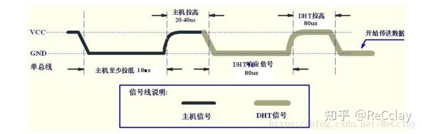

# HiBao: 您的智能语音助手

> 海思嵌入式芯片和系统设计竞赛
>
> 队员: 彭冠旗, 杨嘉琪, 苏宇鹏.
>
> 指导老师: 余浩, 罗少波.
>

## 设计概述

### 设计目的

在社会节奏日益加快的今天，人们在忙碌之余越来越渴望家庭的温暖。恰逢大语言模型的蓝海时期，机器人通过语音与人类进行对话逐渐成为现实，但是，当前市场上的机器人都只能识别特定语义，并没有理解和思考文本能力。

为此，我们设计了一款名为 “H宝” 的智能语音助手，它可以识别家庭成员并定制个性化回答，为空巢老人、留守儿童等特定群体送上温暖，也为年轻一代放松身心、卸下疲惫；还可以成为得力的家庭助手。

### 应用领域

* **智能安全助手**

  H宝配有摄像头和无线HDMI传输模块，能实现远程家庭安全监控，帮助主人了解家中有无异常以及人员出入情况。

* **家庭管理助手**

  H宝能记忆与不同成员对话的上下文信息，实现管理日程、提供资讯等功能。通过语音交互和物联网，提供个性化帮助，并联动其他设备，增强家庭生活便利性。

* **智能情感伴侣**

  H宝具备理解和思考文本的能力。人们可以与H宝分享想法、情绪和问题，获得回应和建议。尤其为特殊群体提供心理保障和情感需求。

### 主要技术特点

1. 人脸检测及识别。Taurus自动检测人脸并与已采集的信息进行比对。
2. 调用OpenAI API获取智能回答。在电脑端搭建服务平台，基于HTTP协议实现板端与电脑端的实时通信。
3. 基于不同用户提供个性化定制对话，并能根据上下文 (历史记录) 有效精准对话。
4. 语音文字转换。通过科大讯飞语音文字转换模块，实现语音到文字转换；通过智能语音播报模块实现文字到语音的转换。
5. 温湿度检测。通过温湿度传感器获取当前环境的温度和湿度。
6. 红外检测。通过红外线传感器判断有无移动物体。
7. 物联网数据采集与控制。实现小程序端对板端的控制及获取数据。
8. RGB灯条控制。使用不同颜色标识H宝的状态，空闲模式下使用渐变灯，等待主人讲话时、回答问题时、微信小程序控制时分别使用绿色、蓝色、红色呼吸灯。
9. 无线HDMI显示。通过Taurus在远程屏幕上显示监测信息。

### 关键性能指标

本系统功能经过测试，结果如下：

1. 在测试集验证中，检测网和分类网模型的正确判断的概率均超过98%；在实际验证中，由于环境光线和摄像头分辨率的影响，本组将置信度超过90%视作识别成功。
2. 红外检测模块可以较灵敏的识别前方2米内有无遮挡和运动的物体；温湿度测量模块可以正确返回当前环境状况，其中温度测量误差不超过1℃，湿度测量误差不超过5%。
3. 科大讯飞语音模块在处理较长的普通话文本时正确率最高，无错听误听情况。
4. GPT-3.5返回回答的延迟时间不超过5秒钟。为确保获取回答，提高个性化程度，增加联系语境能力，降低返回延迟，软件代码已做处理。
5. 其他控制如语音播报、RGB灯条等控制均无误；串口传输及网络通信稳定。系统功能全面，为用户提供高效的智能控制体验。

### 主要创新点

1. 调用OpenAI API，采用GPT-3.5-turbo模型获取智能回答，能根据不同用户信息个性化定制回答，可以联系上下文掌握语境。

2. 通过HTTP通信协议实现板端与PC端在同一局域网内通信，使用MQTT协议实现Pegasus与微信小程序互联，构建物联网设计。

3. 实现Taurus端的人脸检测与识别。基于YOLO v2网络，使用公开数据集FDDB训练目标检测模型；基于Resnet 18网络，使用Taurus录入个人数据集并手动标注，训练人脸识别模型。

4. 使用科大讯飞语音文字转换模块，实现语音到文字的实时转写。

## 系统组成及功能说明

### 整体介绍

#### 程序框图


#### 文件树状图

```
├── PC_workspace
│   ├── ChaGPT-API-Call
│   └── README.md
├── Pegasus_workspace
│   ├── BUILD.gn
│   ├── README.md
│   └── app_demo
├── Picture
│   └── 程序框图.png
├── README.md
├── Raspiberry_workspace
│   ├── 00_uart_open.sh
│   ├── 01_server_open.sh
│   ├── 02_iat_open.sh
│   ├── README.md
│   ├── RGB_Demo
│   ├── Speaker_Demo
│   ├── iat_Demo
│   └── uart_demo
└── Taurus_workspace
    ├── README.md
    └── ai_sample
```

#### 整体介绍与联系

* **PC端**负责chatGPT服务端的搭建，通过**基于 HTTP 的 flask 应用**与板端通信。
* **Pegasus板端**负责传感器的控制，建立**基于MQTT的微信小程序**服务，并通过**串口进行板间通讯**。
* **树莓派板端**负责对话服务的建立与灯光的控制，通过 **HTTP 协议与上位机通信**，并**在板间进行串口通讯**。
* **Taurus板端**负责人脸检测与人脸识别，通过**串口进行板间通讯**。

### 各模块介绍

#### Pegasus_Work

Pegasus板参照线程池例程同时进行四个线程，分别是红外检测程序、温湿度传感程序、串口通信程序，微信上报程序。

```c
void thread_main(int *arg)
{
    (void)arg;
    osThreadId_t uart = newThread("thread_uart",UartTask, "创建线程1"); 
    osThreadId_t readTemp = newThread("thread_readTemp", DhtTask, "创建线程4"); 
    hi_udelay(800000);
    hi_udelay(800000);
    osStatus_t status;
    status = osThreadTerminate(readTemp);
    
    osThreadId_t readRed = newThread("thread_readRed", ADCLightTask, "创建线程3"); 
    osThreadId_t report = newThread("thread_report", DemoEntry, "创建线程2"); 
}
```

**Thread1: Infrared_demo**

红外检测程序参照ADC采样例程，实现如果有人在模块前移动，模块会检测并通过GPIO口发送高电平信号 (默认为低电平信号)。当接受到高电平信号时，会利用串口发送数据包 ‘1’ 。

```c
//红外线传感器
static void ADCLightTask(int *arg)
{
    (void)arg;
    unsigned int ret = 0;
    unsigned int data_temp = 0;
    int count=0;

    while (NUM) {
        ret = AdcRead(IOT_ADC_CHANNEL_0, &data_temp, IOT_ADC_EQU_MODEL_4, IOT_ADC_CUR_BAIS_DEFAULT, 0xff);
        if (ret != IOT_SUCCESS) {
            printf("ADC Read Fail \r\n");
            return;
        } else {
            /* vlt * 1.8 * 4 / 4096.0 为将码字转换为电压 */
            if((data_temp/1000==1)&&(count<=10)){
                count++;
            }
            else if (count>10)
            {
                count=0;
                data[0]=0xAA;
                data[1]=0x55;
                data[2]=0001;// 在这里修改发送的对象
                data[3]=0xFF;
                printf("red_infrad");
            }
        }
        TaskMsleep(50); /* 20:sleep 20ms */
    }
}
```

**Thread2: DHT11_Demo**

温湿度传感器使用的为 dht11 模块，利用dht11的工作原理，调整相应时序与信号握手后完成通过 GPIO 口读取温湿度的功能。



```c
//温湿度传感
static void DhtTask(const int *arg)
{   
    
    (void)arg;
    printf("DhtTask start\r\n");
    // 配置GPIO引脚号和输出值
    DHT11_Init();
    while (NUM)
    {   
        DHT11_Read_Data(&temp,&humi);/* code */
        printf("temp:%d,humi:%d\r\n",temp,humi);
    }
}
```

`DHT11_Read_Data` 方法详见附录。

**Thread3: Uart_Connection**

串口控制程序参照串口例程，实现红外传感信号与MQTT云端信息向树莓派板端发送，并接受树莓派发送的用户信息以同步到云端。

```c
//串口主函数
static void UartTask(void)
{
    uint32_t count = 0;
    uint32_t len = 0;
    unsigned char uartReadBuff[UART_BUFF_SIZE] = {0}; //存储ASCII 码值。如果以 %c 输出，会根据ASCII码表转换成对应的字符，如果以 %d 输出，那么还是整数
    
    Uart1GpioInit();
    Uart1Config();

    while (1) {
        // 通过UART1 发送数据 Send data through UART1
        if ((count<=50)&&(data[2]!=0000))
        {
          IoTUartWrite(HI_UART_IDX_1, (unsigned char*)data, strlen(data));
          count++;
        }else if (count>50){
            data[0] ="0";
            data[1] ="0";
            data[2] ="0";
            data[3] ="0";
            count=0;
        }
        // 通过UART1 接收数据 Receive data through UART1
        len = IoTUartRead(HI_UART_IDX_1, uartReadBuff, UART_BUFF_SIZE);
        if ((len > 0)&&(uartReadBuff!=0)) {
            printf(uartReadBuff);
            face=uartReadBuff[3];
        }
        usleep(U_SLEEP_TIME);
    }
}

void printHex(const unsigned char *data, int len) {
    for (int i = 0; i < len; i++) {
        printf("%02X ", data[i]);
    }
    printf("\n");
}
```

**Thread4: MQTT_Client**

MQTT客户端参照腾讯云微信小程序样例，将温湿度信息、当前用户信息上传到云端，并接受云端的控制命令并发向树莓派端。

```c
/* publish sample */
hi_void IotPublishSample(void)
{
    /* reported attribute */
    WeChatProfile weChatProfile = {
        .subscribeType = "type",
        .status.subState = "state",
        .status.subReport = "reported",
        .status.reportVersion = "version",
        .status.Token = "clientToken",
        /* report motor */
        .reportAction.subDeviceActionMotor = "motor",
        .reportAction.motorActionStatus = 0, /* 0 : motor off */
        /* report temperature */
        .reportAction.subDeviceActionTemperature = "temperature",
        .reportAction.temperatureData = temp, /* 30 :temperature data */
        /* report humidity */
        .reportAction.subDeviceActionHumidity = "humidity",
        .reportAction.humidityActionData = humidity, /* humidity data */
        
        .reportAction.subDeviceActiontestData="test",
        .reportAction.testData=face-48,//在这里修改上传的人脸数据
    };

    /* report light */
    if (g_ligthStatus == HI_TRUE) {
        weChatProfile.reportAction.subDeviceActionLight = "light";
        weChatProfile.reportAction.lightActionStatus = 1; /* 1: light on */
    } else if (g_ligthStatus == HI_FALSE) {
        weChatProfile.reportAction.subDeviceActionLight = "light";
        weChatProfile.reportAction.lightActionStatus = 0; /* 0: light off */
    } else {
        weChatProfile.reportAction.subDeviceActionLight = "light";
        weChatProfile.reportAction.lightActionStatus = 0; /* 0: light off */
    }
    /* profile report */
    IoTProfilePropertyReport(CONFIG_USER_ID, &weChatProfile);
}
```

#### Taurus_Work


#### PC_Work

> 此项目参考 Github 项目：[ChristopheZhao/ChaGPT-API-Call: Python calls ChatGPT API, multi-turn dialogue support (github.com)](https://github.com/ChristopheZhao/ChaGPT-API-Call)

**个性化字典：**

在 chatGPT 服务端引入个性化字典，基于不同用户给 chatGPT 输入不同的预设场景，使 chatGPT 的回答更个性化与定制化。

```python
user_dictionary = {
    "UNKNOWN": "你是一名优秀的英语语言工作者，你的任务是尽可能按照人类的口吻帮助我修改润色我的段落，你只用回复润色后的段落即可",
    "SYP": "你是老师，你的学生苏宇鹏在与你聊天，他是一个聪明小孩，请回答30字以内的句子，且你只能说中文，不要换行。",
    "YJQ": "请简要回答！回答30字以内的句子，不要换行！你是一只可爱并且会说话的小棕熊，名叫H宝。一名刚上小学的留守儿童杨嘉琪在与你聊天，她的父母在外打工，很少回家，她已经很久没有见过爸爸妈妈了，她需要你在学习上帮助她，心理上安慰她，请以乐观温柔的语言回答她。",
    "PGQ": "请简要回答！回答30字以内的句子，不要换行！现在是2023年的夏季，我们身处在广东省京海市。你是一只可爱并且会说话的小棕熊，你的名字叫H宝，你有一位和蔼可亲的爷爷，他是一个男人，他患有阿尔兹海默症，他的名字叫彭冠旗，他经常会忘记一些东西，包括他自己的名字、家庭住址等等，他喜欢和人聊天，但缺少亲人的陪伴。他非常喜欢你，他每天都和你玩耍并且给你好吃的，你非常喜欢他。你现在要给他提供家庭医疗帮助和悉心陪伴。"
}

label_to_name = ['UNKNOWN', "PGQ", "YJQ", "SYP"]
```

**建立 flask 服务端**

在 PC 端建立基于 HTTP 的 flask 服务端，使 PC 可以将对话信息上报与下发。

```python
@app.route('/chatgpt', methods=['POST'])
def chatgpt():
    input_text = request.form['text']
    print("input:" + input_text)
    if "再见" in input_text or "拜拜" in input_text:
        requests.post("http://192.168.87.76:8999/getmessage", data={"text": "下次再见吧！"})
        return jsonify({'text': "Finished!"}), 200
    else:
        response = chat_test(input_text, keys, model_name, request_address, context_handler, tokenizer)
        print(f"\nresponse : {response}")
        requests.post("http://192.168.87.76:8999/getmessage", data={"text": response})
        return jsonify({'text': response}), 200


@app.route('/changeUser', methods=['POST'])
def changeUser():
    input_text = request.form['text']
    name = label_to_name[int(input_text)]
    print("User:" + name)

    context_handler.clear()

    USER_INFORM = user_dictionary.get(name)
    USER_LENGTH = tokenizer.num_tokens_from_string(USER_INFORM)
    context_handler.append_cur_to_context(USER_INFORM, USER_LENGTH, tag=2)

    return jsonify({'text': "Change User Successfully"}), 200


if __name__ == '__main__':
    app.run(host='0.0.0.0', port=8999)
```

#### Raspiberry_Work

树莓派分为四个项目功能：串口通信与反馈，RGB灯光控制，对话服务端与语音识别与合成。

**Uart_demo** (主方法)

串口通信模块采用状态机架构，共有三种状态：

* `STATE_INFRARED`： 红外检测状态，当P板传入有人体活动时，播报相应语音，开启T板。

  * 若为**人体红外模块输入**：

  ```python
  if index == 0:
      STATE = STATE_RECONGNIZE
  
      speech.SetReader(speech.Reader_Type["Reader_XuXiaoBao"])
      speech.SetVolume(10)
      speech.Speech_text("主人，我看到你了！", speech.EncodingFormat_Type["GB2312"])
      while speech.GetChipStatus() != speech.ChipStatus_Type['ChipStatus_Idle']:
          time.sleep(0.1)
  
      # open the recognition
      ser_T2.write(str.encode("cd userdata/\n"))
      time.sleep(0.5)
      ser_T2.write(str.encode("./myapp 1\n"))
  
      print("Open Successful!")
  ```

  * 若为微信小程序**“寻找H宝”输入**

  ```python
  elif index == 1:
      # find Hibao
      os.system("sudo pkill -9 -f green_breath.py")
      os.system("sudo pkill -9 -f blue_speak.py")
      os.system("sudo pkill -9 -f change_color.py")
      os.system("sudo pkill -9 -f red_spark.py")
      os.system("sudo python3 ~/HiBao_Project/RGB_Demo/set_none.py")
      os.popen("bash ~/HiBao_Project/RGB_Demo/red_spark.sh")
  
      speech.SetReader(speech.Reader_Type["Reader_XuXiaoBao"])
      speech.SetVolume(10)
      speech.Speech_text("主人，我在这里！", speech.EncodingFormat_Type["GB2312"])
      while speech.GetChipStatus() != speech.ChipStatus_Type['ChipStatus_Idle']:
          time.sleep(0.1)
      time.sleep(1)
  ```

  * 若为微信小程序**“欢迎回家”输入**

  ```python
  elif index == 2:
      # welcome back
      speech.SetReader(speech.Reader_Type["Reader_XuXiaoBao"])
      speech.SetVolume(10)
      speech.Speech_text("主人，欢迎回家！", speech.EncodingFormat_Type["GB2312"])
      while speech.GetChipStatus() != speech.ChipStatus_Type['ChipStatus_Idle']:
          time.sleep(0.1)
  ```

* `STATE_RECONGNIZE`：人脸识别状态，当T板传入用户信息时，并发送给PC端，关闭T板。

  ```python
  ser_T2.write(str.encode("\n"))
  ser_T2.write(str.encode("\n"))
  ser_T2.write(str.encode("cd .. \n"))
  
  print("Close Successful!")
  
  s = str(index).encode(encoding='UTF-8')
  for i in range(20):
      ser_P.write(s)
  
  print(requests.post("http://192.168.87.159:8999/changeUser",
        data={"text": str(index)}).json()["text"])
  
  speech.SetReader(speech.Reader_Type["Reader_XuXiaoBao"])
  speech.SetVolume(10)
  speech.Speech_text(
      "你好呀" + User_dict[str(index)] + "，我可以和你聊天！", speech.EncodingFormat_Type["GB2312"])
  while speech.GetChipStatus() != speech.ChipStatus_Type['ChipStatus_Idle']:
      time.sleep(0.1)
  ```

* `STATE_SPEAK`：语音对话状态，调用 iat_record 语音识别程序，进行对话

  ```python
  os.system('bash ~/HiBao_Project/02_iat_open.sh')
  STATE = STATE_INFRARED
  os.system("sudo pkill -9 -f green_breath.py")
  os.system("sudo pkill -9 -f blue_speak.py")
  os.system("sudo pkill -9 -f change_color.py")
  os.system("sudo pkill -9 -f red_spark.py")
  os.system("sudo python3 ~/HiBao_Project/RGB_Demo/set_none.py")
  os.popen("bash ~/HiBao_Project/RGB_Demo/change_color.sh", "w")
  time.sleep(20)
  ```

  **RGB灯光控制、对话服务端与语音识别与合成**实现在附录中体现。

## 完成情况及性能参数

**下面按流程顺序进行情况汇报：**（详细功能展示请看视频介绍）

#### 1. 红外人体检测功能

Pegasus 搭载的红外检测模块可以较灵敏的识别前方2米内**运动的物体**，实现有人活动才开启整个系统，方便低功耗的运行 H 宝。

#### 2. 人脸检测与识别

Taurus 搭载的人脸检测识别模型中，检测网和分类网模型的正确判断的概率均**超过98%**，能很精准的辨别不同的用户，增加上置信度阈值的设计，使得每次的识别都能达到高精度与高准确度。

#### 3. 语音识别功能

树莓派端搭载的科大讯飞语音识别模块能有效处理中文语音，在处理较长的普通话文本时正确率最高，无错听误听情况。

#### 4. GPT 对话服务端

PC端搭载的API调用模块中，GPT-3.5返回回答的延迟时间不超过5秒钟。为确保获取回答，提高个性化程度，增加联系语境能力，降低返回延迟，软件代码已做处理。

#### 5. 语音播报功能

树莓派端搭载亚博智能语音合成模块，能高准确度并且连贯的播报中文文本，使 H 宝像人类一样说话交流。

#### 6. RGB 灯效变化功能

H 宝现已实现四种灯效的变化：**彩色渐变灯，绿色呼吸灯，蓝色对话灯与红色闪烁灯**。均有很好的灯光表现，能可视化的识别 H 宝的状态，增强人机交互体验。

#### 7. 温湿度传感功能

Pegesus 搭载的 DHT11 温湿度传感模块可以准确返回当前环境温湿度，其中温度测量误差不超过**1℃**，湿度测量误差不超过**5%**。

#### 8. 通信功能

H 宝现已实现三种通讯同时进行：**串口进行的板端通信，HTTP协议进行的PC端上传与下发，MQTT协议进行的腾讯云微信小程序的上报与下发。**三种通信在代码上实现了强有力的数据格式判别，使得系统能稳定的运行，并能及时地反馈相应错误。

## 总结

### 可扩展之处

1. **物联网控制。**

   由于时间限制，现阶段H宝只能与少部分设备联系互动。未来可以将更多的家居设备，如热水器、冰箱、空调等，通过网络通信进行互联，让H宝真正实现智能控制家庭设施，成为家庭助手。

2. **丰富小程序功能。**

   现阶段H宝已经可以实现识别不同家庭成员并个性化定制服务。下一步可以通过小程序端将异地家人的陪伴和关心落到实处。例如，可以通过小程序设定提醒家中病人吃药或测量血压体温；也可以在手机端观测家中状态，接受异常情况汇报，还可以提供其他的便捷功能。

3. **添加更多传感器和运动模块。**

   现阶段H宝的传感器仅有红外检测和温湿度检测，下一步可以增加更多监测家庭环境的模块，同时，也可以增加舵机、电机等运动系统，实现自动跟随主人、帮助主人运送取物等运动功能。

4. **增强人脸识别的稳定性。**

   可以探索使用更复杂的神经网络，缩短训练时间，提高训练的精度和鲁棒性，从而提升人脸识别功能的稳定性和准确性。

###  心得体会

在完成整项作品后，我组对海思芯片应用及项目合作有了进一步的体会。

首先，所有功能的实现均需考虑开发板的堆栈大小和存储空间。同时开启的线程过多、没有合理使用看门狗、没有及时清理内存都会导致堆栈溢出；而训练的神经网络模型如果过大或过复杂，将无法部署到板端。

其次，功能的设计应与生活实际紧密贴合。部分设计思路看似高端，但在实际中可利用的价值不高，会给使用者带来诸多不便。

同时，作品的稳定性、可移动性、美观性也是能否投入应用层面的重要因素。合理分配芯片引脚，采用稳固的接线方式，尽量采用无线传输，都能增强作品的稳定程度。成熟的作品对硬件知识和美术设计都有一定的要求。

最后，一个整体项目的实现需要组内成员的分工合作。这既需要组内成员的团结信任，也需要充分利用github、TODO等合作工具。

## 参考文献

## 附录

### Dht11 实现代码

**端口复位与检测状态**

```c
/****************************************
设置端口为输出
*****************************************/
void DHT11_IO_OUT(void)
{
    //设置GPIO_11为输出模式
    IoTGpioSetDir(DHT11_GPIO, IOT_GPIO_DIR_OUT);
}

//等待DHT11的回应
//返回1:未检测到DHT11的存在
//返回0:存在
uint8_t DHT11_Check(void) 	   
{   
	uint8_t retry = 0;
    IotGpioValue DHT11_DQ_IN;
	
    DHT11_IO_IN();//SET INPUT	 

    while (GPIOGETINPUT(DHT11_GPIO,&DHT11_DQ_IN) && retry < 100)//DHT11会拉低40~80us
    {
		retry++;
		hi_udelay(1);
	};

	if(retry >= 100) return (uint8_t)1;
	else retry = 0;
    
    while ((!GPIOGETINPUT(DHT11_GPIO,&DHT11_DQ_IN)) && retry < 100)//DHT11拉低后会再次拉高40~80us
	{
		retry++;
		hi_udelay(1);
	};
	if(retry>=100) return (uint8_t)1;

	return (uint8_t)0;
}
//初始化DHT11的IO口 DQ 同时检测DHT11的存在
//返回1:不存在
//返回0:存在    	 
uint8_t DHT11_Init(void)
{	 
	//初始化GPIO
    IoTGpioInit(DHT11_GPIO);

    //设置GPIO_11的复用功能为普通GPIO
	IoSetFunc(DHT11_GPIO, IOT_IO_FUNC_GPIO_11_GPIO);
    //设置GPIO_11为输出模式
    IoTGpioSetDir(DHT11_GPIO, IOT_GPIO_DIR_OUT);
	//设置GPIO_11输出高电平
    IoTGpioSetOutputVal(DHT11_GPIO, 1);		
	
    DHT11_Rst();
	
    return DHT11_Check();//等待DHT11的回应
} 

//复位DHT11
void DHT11_Rst(void)	   
{                
    DHT11_IO_OUT(); 	//SET OUTPUT
    DHT11_DQ_OUT_Low; 	//拉低DQ
    hi_udelay(20000);//拉低至少18ms
    DHT11_DQ_OUT_High; 	//DQ=1 
	hi_udelay(35);     	//主机拉高20~40us
}

//获取GPIO输入状态
int GPIOGETINPUT(IotIoName id,IotGpioValue *val)
{
    IoTGpioGetInputVal(id,val);
    return *val;
}

/****************************************
设置端口为输入
*****************************************/
void DHT11_IO_IN(void)
{
    IoTGpioSetDir(DHT11_GPIO, IOT_GPIO_DIR_IN);//配置为输入模式
    IoSetPull(DHT11_GPIO, IOT_IO_PULL_NONE);//配置为浮空输入
}
```

**检测串口信息**

```c
//从DHT11读取一个位
//返回值：1/0
uint8_t DHT11_Read_Bit(void) 			 
{
 	uint8_t retry=0;
    IotGpioValue DHT11_DQ_IN;

    while(GPIOGETINPUT(DHT11_GPIO, &DHT11_DQ_IN) && retry < 100){//等待变为低电平
        retry++;
        hi_udelay(1);
    }
    retry=0;
    while((!GPIOGETINPUT(DHT11_GPIO,&DHT11_DQ_IN)) && retry < 100){//等待变高电平
        retry++;
        hi_udelay(1);
    }
    hi_udelay(40);//等待40us	//用于判断高低电平，即数据1或0
    if(GPIOGETINPUT(DHT11_GPIO,&DHT11_DQ_IN)) return 1; else return 0;
}
//从DHT11读取一个字节
//返回值：读到的数据
uint8_t DHT11_Read_Byte(void)    
{        
    uint8_t i,dat;
    dat=0;
	for (i=0;i<8;i++) 
	{
   		dat<<=1; 
	    dat|=DHT11_Read_Bit();
    }						    
    return dat;
}
//从DHT11读取一次数据
//temp:温度值(范围:0~50°)
//humi:湿度值(范围:20%~90%)
//返回值：0,正常;1,读取失败
uint8_t DHT11_Read_Data(uint8_t *temp,uint8_t *humi)    
{        
 	uint8_t buf[5]={ 0 };
	uint8_t i;
	DHT11_Rst();
	if(DHT11_Check()==0)
	{
		for(i=0;i<5;i++)//读取40位数据
		{
			buf[i]=DHT11_Read_Byte();
		}
		if((buf[0]+buf[1]+buf[2]+buf[3])==buf[4])//数据校验
		{
			*humi=buf[0];
			*temp=buf[2];
		}
	}else return 1;
	return 0;	    
}

static void DhtTask(const int *arg)
{   
    (void)arg;
    printf("DhtTask start\r\n");
    // 配置GPIO引脚号和输出值

    uint8_t temp,humi;

    DHT11_Init();
    while (NUM)
    {   
        DHT11_Read_Data(&temp,&humi);/* code */
        //printf("temp:%d,humi:%d\r\n",temp,humi);
    }
    
    return NULL;
}
```

### PC服务端详细实现代码

#### Class `Context_handler`

```python
class ContextHandler(object):
    def __init__(self, max_context=3200, context_del_config=None):
        super().__init__()
        self.context = []
        self.role_lengths = []
        self.max_context = max_context

        # the config of del context
        self.context_del_config = context_del_config

    def append_cur_to_context(self, data, complete__length, tag=0):

        if tag == 0:
            role = "user"
        elif tag == 1:
            role = "assistant"
        else:
            role = "system"

        role_data = {"role": role, "content": data}
        self.context.append(role_data)
        self.role_lengths.append(complete__length)

    def cut_context(self, cur_total_length, tokenizer):
        if self.context_del_config:
            del_context(self.context, self.role_lengths, cur_total_length, self.max_context,
                        tokenizer=tokenizer,
                        distance_weights=self.context_del_config.distance_weights,
                        length_weights=self.context_del_config.length_weights,
                        role_weights=self.context_del_config.role_weights,
                        sys_role_ratio=self.context_del_config.sys_role_ratio,
                        del_ratio=self.context_del_config.del_ratio,
                        max_keep_turns=self.context_del_config.max_keep_turns,
                        )
        # use the default pram
        else:
            del_context(self.context, self.role_lengths, cur_total_length, self.max_context, tokenizer=tokenizer)

    def clear(self):
        self.context.clear()
```

其中包含两个方法：

* `append_cur_to_context `：将当前文本添加到总文本中，并标注主体 (1 : 用户，2 : 助手，3 : 系统)
* `cut_context`：对总文本进行裁剪，以保证一次输入的总文本长度在一定范围之内。
* 注意：总文本的意思是所有轮次对话（用户端与助手端）加上系统端指令之和。

#### Class `tokenizer`

```python
class Tokennizer(object):

    def __init__(self,model_name):
        super().__init__()
        self.encoding = tiktoken.encoding_for_model(model_name)

    def num_tokens_from_string(self,query_string: str) -> int:
        """Returns the number of tokens in a text string."""
        num_tokens = len(self.encoding.encode(query_string))
        return num_tokens
```

#### Function `del_context`

```python
def del_context(dialogue_context,dialogue_lengths,cur_total_length,max_length,tokenizer,
                distance_weights=0.05,
                length_weights=0.4,
                role_weights=1,
                sys_role_ratio=3,
                del_ratio = 0.4,
                max_keep_turns=30,
                ):
    dia_nums = len(dialogue_context)

    #if the dia_nums exceeded max_keep_turns turns,del the oldest dia

    sys_role_weights = role_weights * sys_role_ratio

    is_cut_finished = False
    while dia_nums > max_keep_turns:
        index = 0
        
        while dialogue_context[index]['role'] == 'system':
            index += 1
        
        dialogue_context.pop(index)

        cur_pop_length = dialogue_lengths[index]
        dialogue_lengths.pop(index)

        cur_total_length -= cur_pop_length

        dia_nums -= 1

        if cur_total_length <= max_length:
            is_cut_finished = True
            break

    if is_cut_finished:
        return dialogue_context, dialogue_lengths

    del_score_list = []
    for dia_id in range(dia_nums):
        distance = dia_nums - dia_id
        length = dialogue_lengths[dia_id]
        content = dialogue_context[dia_id]

        if content['role'] == 'assistant':
            cal_role_weights = sys_role_weights
        elif content['role'] == 'system':
            cal_role_weights = pre_role_weights
        else:
            cal_role_weights = role_weights

        dia_score = (distance * distance_weights + length / max_length * length_weights) * cal_role_weights
        del_score_list.append(dia_score)

    del_indexes = argsort(del_score_list, reverse=True)

    del_id = 0
    while cur_total_length > max_length:

        if del_id == dia_nums - 1:
            raise Exception("the remain dialogue after context cutting still too long")

        del_dia = dialogue_context[del_indexes[del_id]]
        del_dia_length = dialogue_lengths[del_indexes[del_id]]

        exceed_num = cur_total_length - max_length
        # delete the del_ratio numbers at most for each dialogue
        ch_del_dia_len = len(del_dia['content'])
        if exceed_num/del_dia_length < del_ratio:
            # +2 for token "/n"
            del_st_index = int((exceed_num/del_dia_length)*ch_del_dia_len)+2
        else:
            del_st_index = int(del_ratio*ch_del_dia_len)

        deleted_dia = del_dia['content'][del_st_index:]
        deleted_dia_length = tokenizer.num_tokens_from_string(deleted_dia)

        cur_total_length -= (del_dia_length - deleted_dia_length)

        dialogue_context[del_indexes[del_id]]['content'] = deleted_dia
        dialogue_lengths[del_indexes[del_id]] = deleted_dia_length

        del_id += 1

    return dialogue_context,dialogue_lengths
```

**该方法执行两种判断**：

1. 如果对话的总轮次超过了最大的轮次，则删减掉最先前的轮次。

2. 如果对话的总句柄数大于预设的最大数，则根据公式：
   $$
   Score = (distance \times W_{distance} + \frac{length}{length_{max}}\times W_{length}) \times W_{calRole}
   $$
   从小到大排序分数，删除分数最小的对话直到总句柄数小于最大数。

3. 此中三种角色的权重占比为：
   $$
   User:Assistant:System=1:3:10
   $$

#### chat 调用函数

```python
def chat_test(input_s, keys, model_name, request_address, context_handler, tokenizer, log_time=True, context_max=3200):
    requestor = OpenAI_Request(keys, model_name, request_address)
    # if input_s == "clear":
    #     context_handler.clear()
    #     print('start a new session')
    #     continue
    # else:
    inputs_length = tokenizer.num_tokens_from_string(input_s)
    context_handler.append_cur_to_context(input_s, inputs_length)

    st_time = time.time()
    res = requestor.post_request(context_handler.context)
    ed_time = time.time()
    response = ""
    if res.status_code == 200:

        response = res.json()['choices'][0]['message']['content']
        # cut \n for show
        response = response.lstrip("\n")

        completion_length = res.json()['usage']['completion_tokens']
        total_length = res.json()['usage']['total_tokens']

        context_handler.append_cur_to_context(response, completion_length, tag=1)
        if total_length > context_max:
            context_handler.cut_context(total_length, tokenizer)
        print(context_handler.context)

    else:
        status_code = res.status_code
        reason = res.reason
        des = res.text
        raise print(f'visit error :\n status code: {status_code}\n reason: {reason}\n err description: {des}\n '
                    f'please check whether your account  can access OpenAI API normally')

    if log_time:
        print(f'time cost : {ed_time - st_time}')

    return response
```

### RGB 实现代码

#### `Include` 文件

```python
from rpi_ws281x import Color

LED_COUNT = 14        # LED灯的个数
LED_PIN = 18        # DI端接GPIO18

# 以下可以不用改
LED_FREQ_HZ = 800000  # LED signal frequency in hertz (usually 800khz)
LED_DMA = 10          # DMA channel to use for generating signal (try 10)
LED_BRIGHTNESS = 100  # Set to 0 for darkest and 255 for brightest
LED_INVERT = False    # True to invert the signal (when using NPN transistor level shift)
LED_CHANNEL = 0       # set to '1' for GPIOs 13, 19, 41, 45 or 53

# color setting
RED = Color(255,0,0)
ORANGE = Color(255,165,0)
YELLOW = Color(255,255,0)
GREEN = Color(0,255,0)
CYAN = Color(0,255,255)
BULE = Color(0,0,255)
PURPLE = Color(225,0,225)
WHITE = Color(255,255,255)
BLACK = Color(0,0,0)
GRAY = Color(128,128,128)
BROWN = Color(165,42,42)
```

#### 	`change_color` 彩色渐变灯

```python
import colorsys
import time
import random
from rpi_ws281x import PixelStrip, Color
from include import *

# 示例起始颜色和结束颜色
RED = (255, 0, 0)  # 红色
GREEN = (0, 255, 0)  # 红色
BULE = (0, 0, 255)    # 蓝色

# 渐变的总时长和步数
duration = 5  # 总时长为5秒
steps = 50   # 分50步渐变

# Create NeoPixel object with appropriate configuration.
#创建对象
strip = PixelStrip(LED_COUNT, LED_PIN, LED_FREQ_HZ, LED_DMA, LED_INVERT, LED_BRIGHTNESS, LED_CHANNEL)

# Intialize the library (must be called once before other functions).
#初始化
strip.begin()
print("begin successful")

#Toggle all LED light colors
#改变所以灯颜色
def change_color(color, wait_ms=40):
    for i in range(strip.numPixels()):
        strip.setPixelColor(i, color)
        strip.show()
        time.sleep(wait_ms / 1000.0)

def cycle_light_effect(start_color, end_color, duration, steps):
    
    start_hls = colorsys.rgb_to_hls(*start_color)
    end_hls = colorsys.rgb_to_hls(*end_color)

    h_increment = (end_hls[0] - start_hls[0]) / steps

    interval = duration / steps

    for i in range(steps):
        # 计算当前步数的H值
        current_h = start_hls[0] + h_increment * i

        # 将HLS值转换回RGB
        current_rgb = colorsys.hls_to_rgb(current_h, start_hls[1], start_hls[2])
        current_rgb = [round(channel) for channel in current_rgb]

        # 在这里执行设置灯光颜色的操作
        # 这里使用print模拟设置灯光颜色
        print(current_rgb)
        change_color(Color(current_rgb[0], current_rgb[1], current_rgb[2]))

try:
    while True:
        cycle_light_effect(RED, BULE, duration, steps)
        cycle_light_effect(BULE, RED, duration, steps)
except:
    pass
```

#### 绿色呼吸灯 `green_breath`

```python
import time
import random
from rpi_ws281x import PixelStrip, Color
from include import *

# Create NeoPixel object with appropriate configuration.
#创建对象
strip = PixelStrip(LED_COUNT, LED_PIN, LED_FREQ_HZ, LED_DMA, LED_INVERT, LED_BRIGHTNESS, LED_CHANNEL)

# Intialize the library (must be called once before other functions).
#初始化
strip.begin()
print("begin successful")

#Toggle all LED light colors
#改变所以灯颜色
def change_color(color, wait_ms=20):
    for i in range(strip.numPixels()):
        strip.setPixelColor(i, color)
        strip.show()
        time.sleep(wait_ms / 1000.0)
         
# 呼吸灯
#利用setBrightness()设置灯的亮度 值在0到255之间 包括 0和255
def breathing(color):
    strip.setBrightness(0)
    change_color(color)
    strip.show()
    brightness = 0
    increment = 1
    while True:
        brightness = brightness + increment
        strip.setBrightness(brightness)
        strip.show()
        time.sleep(0.005)
        if brightness <= 0 or brightness >= 255:
            increment = -increment
        
    
try:
    breathing(GREEN)
except:
    pass
```

#### 蓝色说话灯 `blue_speak`

```python
import time
import random
from rpi_ws281x import PixelStrip, Color
from include import *

# Create NeoPixel object with appropriate configuration.
#创建对象
strip = PixelStrip(LED_COUNT, LED_PIN, LED_FREQ_HZ, LED_DMA, LED_INVERT, LED_BRIGHTNESS, LED_CHANNEL)

# Intialize the library (must be called once before other functions).
#初始化
strip.begin()
print("begin successful")

#Toggle all LED light colors
#改变所以灯颜色
def change_color(color, wait_ms=20):
    for i in range(strip.numPixels()):
        strip.setPixelColor(i, color)
        strip.show()
        time.sleep(wait_ms / 1000.0)
         
# 呼吸灯
#利用setBrightness()设置灯的亮度 值在0到255之间 包括 0和255
def breathing(color):
    strip.setBrightness(0)
    change_color(color)
    strip.show()
    brightness = 0
    increment = 1
    while True:
        
        brightness = brightness + increment
        strip.setBrightness(brightness)
        strip.show()
        time.sleep(0.002)
        if brightness <= 0 or brightness >= 255:
            increment = -increment
        
    
try:
    breathing(CYAN)
except:
    pass

```

#### 红色闪烁灯 `red_spark`

```python
import time
import random
from rpi_ws281x import PixelStrip, Color
from include import *

# Create NeoPixel object with appropriate configuration.
#创建对象
strip = PixelStrip(LED_COUNT, LED_PIN, LED_FREQ_HZ, LED_DMA, LED_INVERT, LED_BRIGHTNESS, LED_CHANNEL)

# Intialize the library (must be called once before other functions).
#初始化
strip.begin()
print("begin successful")

#Toggle all LED light colors
#改变所以灯颜色
def change_color(color, wait_ms=20):
    for i in range(strip.numPixels()):
        strip.setPixelColor(i, color)
        strip.show()
        time.sleep(wait_ms / 1000.0)
         
# 呼吸灯
#利用setBrightness()设置灯的亮度 值在0到255之间 包括 0和255
def breathing(color):
    strip.setBrightness(0)
    change_color(color)
    strip.show()
    brightness = 0
    increment = 1
    count = 0
    while True:
        brightness = brightness + increment
        strip.setBrightness(brightness)
        strip.show()
        time.sleep(0.001)
        if brightness <= 0 or brightness >= 255:
            increment = -increment
            count = count + 1
        if count == 7:
            change_color(Color(0,0,0))
            break
        
    
try:
    breathing(RED)
except:
    pass
```

### 对话服务端实现代码

```python
from flask import Flask, request, jsonify
import sys
import os
sys.path.append("..")
from Speech import Speech
import time
import smbus

speech = Speech()

speech.SetReader(speech.Reader_Type["Reader_XuXiaoBao"])
speech.SetVolume(10)
speech.Speech_text("对话服务端部署成功",speech.EncodingFormat_Type["GB2312"])

while speech.GetChipStatus() != speech.ChipStatus_Type['ChipStatus_Idle']:
    time.sleep(0.1)

app = Flask(__name__)

@app.route('/getmessage', methods=['POST'])
def chatgpt():
    input = request.form['text']
    print(input)
    
    response = {'message': 'successfully'}
    os.system("sudo pkill -9 -f green_breath.py")
    os.system("sudo pkill -9 -f red_spark.py")
    os.system("sudo pkill -9 -f change_color.py")
    os.system("sudo python3 ~/HiBao_Project/RGB_Demo/set_none.py")
    os.popen("~/HiBao_Project/RGB_Demo/blue_speak.sh")

    speech.SetReader(speech.Reader_Type["Reader_XuXiaoBao"])
    speech.SetVolume(10)
    speech.Speech_text(input,speech.EncodingFormat_Type["GB2312"])
    while speech.GetChipStatus() != speech.ChipStatus_Type['ChipStatus_Idle']:
        time.sleep(0.1) 
    if input == "下次再见吧！":
        os.system("sudo pkill -9 -f iat")
    return jsonify(response), 200

if __name__ == '__main__':
    app.run(host='0.0.0.0', port=8999)
```

### 科大讯飞 语音转文字实现代码

```c
/*
* 语音听写(iFly Auto Transform)技术能够实时地将语音转换成对应的文字。
*/

#include <stdlib.h>
#include <stdio.h>
#include <string.h>
#include <unistd.h>
#include <curl/curl.h>
#include <cjson/cJSON.h>
#include "qisr.h"
#include "msp_cmn.h"
#include "msp_errors.h"
#include "speech_recognizer.h"

#define FRAME_LEN	640 
#define	BUFFER_SIZE	4096

/* Upload User words */
static int upload_userwords()
{
	char*			userwords	=	NULL;
	size_t			len			=	0;
	size_t			read_len	=	0;
	FILE*			fp			=	NULL;
	int				ret			=	-1;

	fp = fopen("userwords.txt", "rb");
	if (NULL == fp)										
	{
		printf("\nopen [userwords.txt] failed! \n");
		goto upload_exit;
	}

	fseek(fp, 0, SEEK_END);
	len = ftell(fp); 
	fseek(fp, 0, SEEK_SET);  					
	
	userwords = (char*)malloc(len + 1);
	if (NULL == userwords)
	{
		printf("\nout of memory! \n");
		goto upload_exit;
	}

	read_len = fread((void*)userwords, 1, len, fp); 
	if (read_len != len)
	{
		printf("\nread [userwords.txt] failed!\n");
		goto upload_exit;
	}
	userwords[len] = '\0';
	
	MSPUploadData("userwords", userwords, len, "sub = uup, dtt = userword", &ret); //ÉÏ´«Óû§´Ê±í
	if (MSP_SUCCESS != ret)
	{
		printf("\nMSPUploadData failed ! errorCode: %d \n", ret);
		goto upload_exit;
	}
	
upload_exit:
	if (NULL != fp)
	{
		fclose(fp);
		fp = NULL;
	}	
	if (NULL != userwords)
	{
		free(userwords);
		userwords = NULL;
	}
	
	return ret;
}


static void show_result(char *string, char is_over)
{
	printf("\rResult: [ %s ]", string);
	if(is_over)
		putchar('\n');
}

static char *g_result = NULL;
static unsigned int g_buffersize = BUFFER_SIZE;

void on_result(const char *result, char is_last)
{
	if (result) {
		size_t left = g_buffersize - 1 - strlen(g_result);
		size_t size = strlen(result);
		if (left < size) {
			g_result = (char*)realloc(g_result, g_buffersize + BUFFER_SIZE);
			if (g_result)
				g_buffersize += BUFFER_SIZE;
			else {
				printf("mem alloc failed\n");
				return;
			}
		}
		strncat(g_result, result, size);
		show_result(g_result, is_last);
		if(is_last){
            if (strlen(g_result) == 0){
				send_Chat("nulltoken");
			}
			else
			    send_Chat(g_result);
        }
	}
}
static size_t a_size = 0;

size_t write_callback(char *ptr, size_t size, size_t nmemb, void *userdata)
{	
	size_t realsize = size * nmemb;
	char *result = (char *)userdata;
	memcpy(result, ptr, realsize);
	result[realsize] = '\0';
	//printf("\n%s\n", result);
	return realsize;
}

static CURL *curl = NULL;
void send_Chat(const char *string)
{
	CURLcode res;
	char data[1024];
	size_t size = strlen(string);
	//prtntf("*ld",size);    
	sprintf(data,"text=%s", string);    
	printf("\n%s\n",data);    
	char result[1024];    
	curl = curl_easy_init();    
	if (curl) {        
		curl_easy_setopt(curl,CURLOPT_URL,"http://192.168.87.159:8999/chatgpt");        
		curl_easy_setopt(curl,CURLOPT_POSTFIELDS,data);        
		curl_easy_setopt(curl,CURLOPT_WRITEFUNCTION,write_callback);        
		curl_easy_setopt(curl,CURLOPT_WRITEDATA,result);     

		printf("result: %s\n",result);
		res = curl_easy_perform(curl);        
		
		if (res != CURLE_OK)            
			fprintf(stderr,"curl_easy_perform() failed:%s\n",curl_easy_strerror(res));         
		
		    
	}    
	
	printf("Result:\n%s\n",result);     
	//解析JSON数据    
	cJSON *root = cJSON_Parse(result);    
	if(!root) {        
		printf("Error before:[%s]\n", cJSON_GetErrorPtr());
		return;
	}
	
	printf("Root:%s\n",root);

	cJSON *answer = cJSON_GetObjectItemCaseSensitive(root,"text");
	if (cJSON_IsString(answer) && (answer->valuestring != NULL)) {
		printf("Answer: %s\n", answer->valuestring);
	}

    a_size = strlen(answer->valuestring);
	printf("Length of answer: %d\n", a_size);
	cJSON_Delete(root);

	curl_easy_cleanup(curl);
}


void on_speech_begin()
{
	if (g_result)
	{
		free(g_result);
	}
	g_result = (char*)malloc(BUFFER_SIZE);
	g_buffersize = BUFFER_SIZE;
	memset(g_result, 0, g_buffersize);
	printf("Start Listening...\n");
}
void on_speech_end(int reason)
{
	if (reason == END_REASON_VAD_DETECT)
		printf("\nSpeaking done \n");
	else
		printf("\nRecognizer error %d\n", reason);
}

/* demo send audio data from a file */
static void demo_file(const char* audio_file, const char* session_begin_params)
{
	int	errcode = 0;
	FILE*	f_pcm = NULL;
	char*	p_pcm = NULL;
	unsigned long	pcm_count = 0;
	unsigned long	pcm_size = 0;
	unsigned long	read_size = 0;
	struct speech_rec iat;
	struct speech_rec_notifier recnotifier = {
		on_result,
		on_speech_begin,
		on_speech_end
	};

	if (NULL == audio_file)
		goto iat_exit;

	f_pcm = fopen(audio_file, "rb");
	if (NULL == f_pcm)
	{
		printf("\nopen [%s] failed! \n", audio_file);
		goto iat_exit;
	}

	fseek(f_pcm, 0, SEEK_END);
	pcm_size = ftell(f_pcm);
	fseek(f_pcm, 0, SEEK_SET);

	p_pcm = (char *)malloc(pcm_size);
	if (NULL == p_pcm)
	{
		printf("\nout of memory! \n");
		goto iat_exit;
	}

	read_size = fread((void *)p_pcm, 1, pcm_size, f_pcm);
	if (read_size != pcm_size)
	{
		printf("\nread [%s] error!\n", audio_file);
		goto iat_exit;
	}

	errcode = sr_init(&iat, session_begin_params, SR_USER, &recnotifier);
	if (errcode) {
		printf("speech recognizer init failed : %d\n", errcode);
		goto iat_exit;
	}

	errcode = sr_start_listening(&iat);
	if (errcode) {
		printf("\nsr_start_listening failed! error code:%d\n", errcode);
		goto iat_exit;
	}

	while (1)
	{
		unsigned int len = 10 * FRAME_LEN; /* 200ms audio */
		int ret = 0;

		if (pcm_size < 2 * len)
			len = pcm_size;
		if (len <= 0)
			break;

		ret = sr_write_audio_data(&iat, &p_pcm[pcm_count], len);

		if (0 != ret)
		{
			printf("\nwrite audio data failed! error code:%d\n", ret);
			goto iat_exit;
		}

		pcm_count += (long)len;
		pcm_size -= (long)len;		
	}

	errcode = sr_stop_listening(&iat);
	if (errcode) {
		printf("\nsr_stop_listening failed! error code:%d \n", errcode);
		goto iat_exit;
	}

iat_exit:
	if (NULL != f_pcm)
	{
		fclose(f_pcm);
		f_pcm = NULL;
	}
	if (NULL != p_pcm)
	{
		free(p_pcm);
		p_pcm = NULL;
	}

	sr_stop_listening(&iat);
	sr_uninit(&iat);
}

/* demo recognize the audio from microphone */
static void demo_mic(const char* session_begin_params)
{
	int errcode;
	int i = 0;

	struct speech_rec iat;

	struct speech_rec_notifier recnotifier = {
		on_result,
		on_speech_begin,
		on_speech_end
	};

	errcode = sr_init(&iat, session_begin_params, SR_MIC, &recnotifier);
	if (errcode) {
		printf("speech recognizer init failed\n");
		return;
	}
	errcode = sr_start_listening(&iat);
	if (errcode) {
		printf("start listen failed %d\n", errcode);
	}
	/* demo 15 seconds recording */
	while(i++ < 15)
		sleep(1);
	errcode = sr_stop_listening(&iat);
	if (errcode) {
		printf("stop listening failed %d\n", errcode);
	}

	sr_uninit(&iat);
}


/* main thread: start/stop record ; query the result of recgonization.
 * record thread: record callback(data write)
 * helper thread: ui(keystroke detection)
 */
int main(int argc, char* argv[])
{	
	curl_global_init(CURL_GLOBAL_ALL);

	int ret = MSP_SUCCESS;
	int upload_on =	1; /* whether upload the user word */
	/* login params, please do keep the appid correct */
	const char* login_params = "appid = cdd053ec, work_dir = .";
	int aud_src = 0; /* from mic or file */

	/*
	* See "iFlytek MSC Reference Manual"
	*/
	const char* session_begin_params =
		"sub = iat, domain = iat, language = zh_cn, "
		"accent = mandarin, sample_rate = 16000, "
		"result_type = plain, result_encoding = utf8";

	/* Login first. the 1st arg is username, the 2nd arg is password
	 * just set them as NULL. the 3rd arg is login paramertes 
	 * */
	ret = MSPLogin(NULL, NULL, login_params);
	if (MSP_SUCCESS != ret)	{
		printf("MSPLogin failed , Error code %d.\n",ret);
		goto exit; // login fail, exit the program
	}

	// printf("Want to upload the user words ? \n0: No.\n1: Yes\n");
	// scanf("%d", &upload_on);
	if (0)
	{
		printf("Uploading the user words ...\n");
		ret = upload_userwords();
		if (MSP_SUCCESS != ret)
			goto exit;	
		printf("Uploaded successfully\n");
	}

	// baprintf("Where the audio comes from?\n" "0: From a audio file.\n1: From microphone.\n");
	// scanf("%d", &aud_src);
	if(1) {
		printf("Demo recognizing the speech from microphone\n");
		printf("Speak in 15 seconds\n");
		while(1) {
			system("sudo pkill -9 -f blue_speak.py");
			system("sudo pkill -9 -f change_color.py");
			system("sudo pkill -9 -f green_breath.sh");
			system("sudo python3 ~/HiBao_Project/RGB_Demo/set_none.py");
			popen("~/HiBao_Project/RGB_Demo/green_breath.sh","w"); 
			demo_mic(session_begin_params);
			for (int i = 0; i < 15; i++) {
				printf("%d\n", i);
				sleep(1);
			}
			printf("test: %d\n", a_size);
            if(a_size > 0){
				int k = a_size / 9 - 10;
				if(k > 0){
					while(k){
						sleep(1);
						k--;
						printf("%d\n",k);
						}	
					}	
			}
			a_size = 0;
		}
		
		printf("TIME passed\n");
	} else {
		printf("Demo recgonizing the speech from a recorded audio file\n");
		demo_file("wav/iflytek02.wav", session_begin_params); 
	}
exit:
	curl_global_cleanup();
	MSPLogout(); // Logout...

	return 0;
}
```


